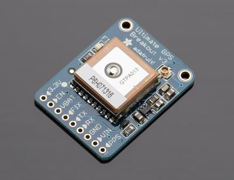

# Commuter Incentive
my hackathon project for techcrunch disrupt

## What is CI?

CI is an application which uses SF city data for bike counters and bike crashes to
generate a safe, but fun competition between you fellow coworkers around commuting on your bicycle.

## Which APIs are used?

 - Here Location Platform -- Here's mapping platform, and their routing to allow waypoints and avoidance points was very helperful
 - Mapquest Geocoding API -- Used to translate addresses in lat long coordinates
 - ThingSpace Device Messaging API -- Using geolocation sensors that in a future world would be embedded in the handlebar of your bicycle  - but in this world is on an arduino sensor to track and verify a user's passing by a Bike Counter

## Where is the data from?

data.sfgov.org

## So where is the incentive?

Not only, do people love to compete with each other, especially when it comes down to dedication as opposed to talent, but but setting up a Commuter Incentive with your company you can offer rewards for the top ranking commuters. You can compete with your coworkers, or you can set up a friendly competition between neighboring offices.

## Where is the greater good?

Not only is it important to encourage life long health and friendly competition, but through the use of crash data we can easily visualize and avoid dangerous intersections

## What's the future?

Working with the city government to apply the knowledge from the commuter ranking, the counters and the crash data, as well as potentially adding weather data coorelated with crash data to determine when and where people do and should be biking.
